# Project Guide — Read Me to Understand Everything

This is the **plain-language companion** to the repository. It explains, from
the ground up, *what* this project is, *why* it exists, *how the pieces fit
together*, and *how to run it* — with mind-maps and diagrams you can follow even
if you're new to climate modelling or Python. (The diagrams render automatically
on GitHub.)

If you only read one section, read **"The 30-second version"** and look at the
first mind-map.

---

## The 30-second version

Scientists are studying **solar geoengineering** — specifically **Stratospheric
Aerosol Injection (SAI)**, the idea of spraying tiny reflective particles high
in the atmosphere to cool the planet, like a man-made volcano. It could reduce
some climate damage, but it has side-effects we don't fully understand.

One side-effect is on **winter weather in the mid-latitudes** (Europe, the US,
Asia): SAI can nudge the jet stream and storm tracks, changing how cold, stormy,
or mild winters are. **How big that effect is, and whether different climate
models agree on it, is uncertain.**

This project builds three things to help pin that uncertainty down:

1. **A software tool** that measures "extreme weather" from climate-model data.
2. **A dataset** of those measurements across 4 models and 2 SAI strategies.
3. **A written assessment** that updates the official "uncertainty entry" with
   the new evidence.

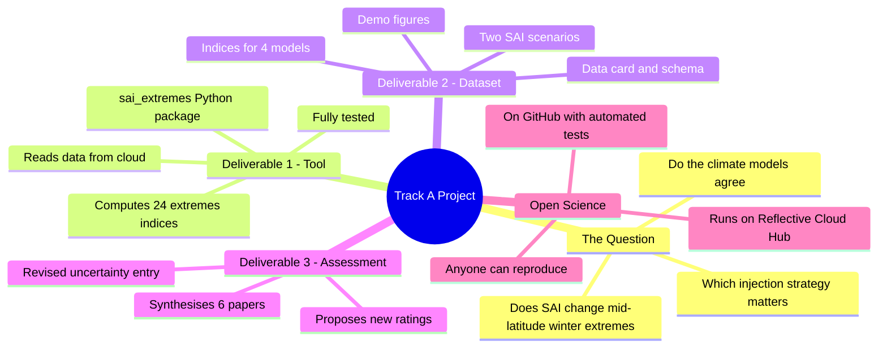

---

## 1. The science, in everyday terms

### What is SAI?

When a big volcano erupts (like Pinatubo in 1991), it throws sulfur high into the
**stratosphere** (the calm layer ~15–30 km up). Those particles reflect a little
sunlight back to space, and the planet cools for a year or two. **SAI** proposes
to do this deliberately and continuously to offset global warming.

### Why does it affect *winter winds*?

Here's the chain of cause and effect. The key insight: the particles don't just
reflect sunlight — they also **absorb heat and warm the stratosphere**, and that
warming reshapes the winds.

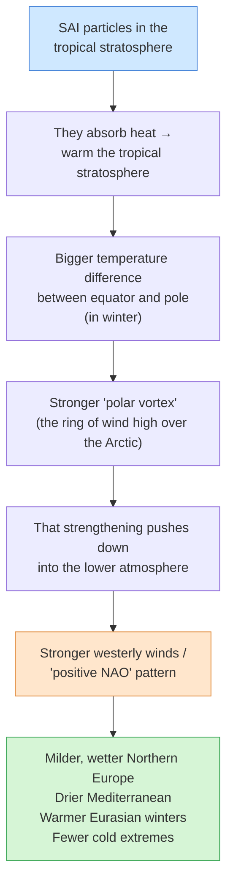

Two crucial details this project tests:

- **It's the particles, not just the cooling.** If you simulate cooling by simply
  "dimming the sun" (no particles), this winter-wind effect *doesn't appear*. So
  the effect depends on the **aerosol physics** — which means **where you inject**
  matters a lot.
- **Two injection strategies are compared:**

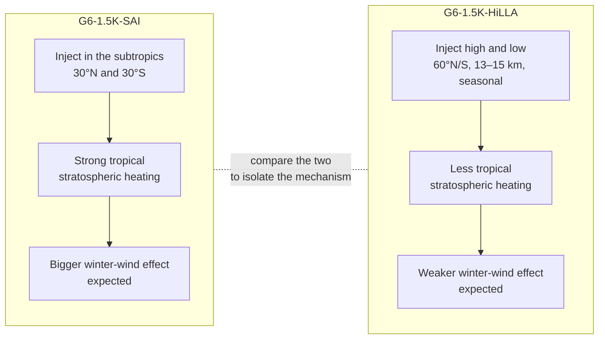

Comparing these two is like a controlled experiment: if the winter-wind effect is
much weaker under HiLLA, that confirms it's driven by tropical stratospheric
heating.

### Glossary (the jargon, decoded)

| Term | Plain meaning |
|------|---------------|
| **SAI** | Stratospheric Aerosol Injection — the cooling-particles idea |
| **GeoMIP** | A coordinated project where many modelling groups run the *same* SAI experiment so results can be compared |
| **G6-1.5K-SAI / G6-1.5K-HiLLA** | The two specific SAI experiments compared here |
| **Earth system model** (CESM, MIROC, UKESM, E3SM) | Big physics simulators of the whole climate; each lab has its own |
| **Mid-latitudes** | The temperate zone — roughly 30°–60° N/S (Europe, US, China) |
| **Jet stream** | A fast river of wind high in the atmosphere that steers storms |
| **NAO** (North Atlantic Oscillation) | A see-saw in air pressure between Iceland and the Azores that controls European winters |
| **Polar vortex** | A ring of strong winds circling the Arctic in winter |
| **Blocking** | When that flow gets "stuck," causing prolonged cold/calm spells |
| **ETCCDI indices** | A standard set of ~27 agreed recipes for measuring climate extremes (e.g. "number of frost days") |
| **Extremes index** | A single number summarising extreme weather, e.g. *frost days = how many days below 0 °C this year* |
| **Baseline / reference** | The "world without SAI" you compare against to isolate SAI's effect |

---

## 2. What's in this repository

Three deliverables, each in its own folder.

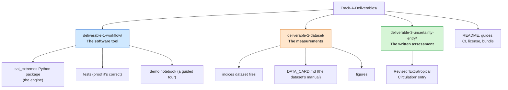

### How the three connect (the story arc)

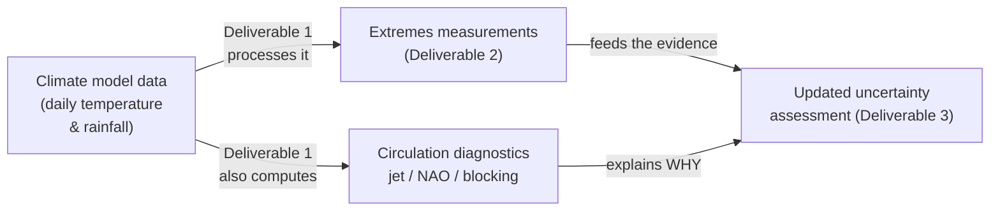

- **Deliverable 1 answers "what tools do we need?"** — it's the reusable engine.
- **Deliverable 2 answers "WHAT happens?"** — the numbers: how extremes change.
- The **circulation diagnostics** answer "**WHY** does it happen?" — jet/NAO/blocking.
- **Deliverable 3** ties it together into a decision-useful assessment.

---

## 3. Deliverable 1 — the software tool (`sai_extremes`)

### What it does

You give it daily climate-model data (max temperature, min temperature, rainfall)
for a model and an SAI scenario. It gives you back **24 "extremes indices"** — one
number per year, per location — like *frost days*, *heaviest 5-day rainfall*, or
*warm-spell length*. Then it can also compute **circulation diagnostics** (jet
position, NAO, blocking) that explain the weather patterns behind those extremes.

### The 24 indices, grouped

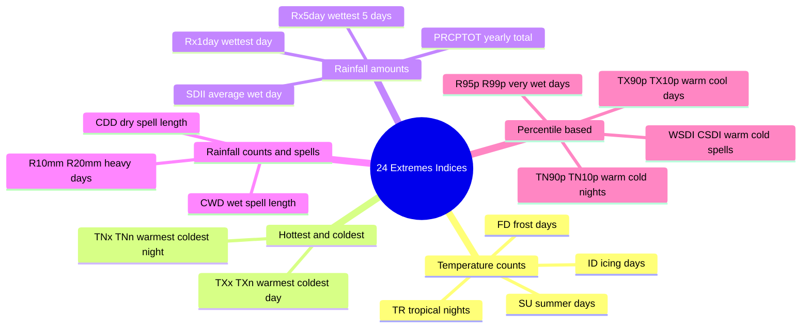

The **"percentile-based"** group is the clever part the project added: instead of
fixed thresholds (like 0 °C), they ask "how often is it more extreme than the
*local* historical 90th-or-10th percentile?" — which adapts to each place.

### How the code is built (and why it's trustworthy)

The single most important design idea: **the maths is separated from the data
plumbing.** The actual formulas live in tiny, simple functions called **kernels**
that use only NumPy (basic Python maths). These are checked against hand-computed
answers in the tests. A second layer wraps them to run efficiently over huge
climate datasets.

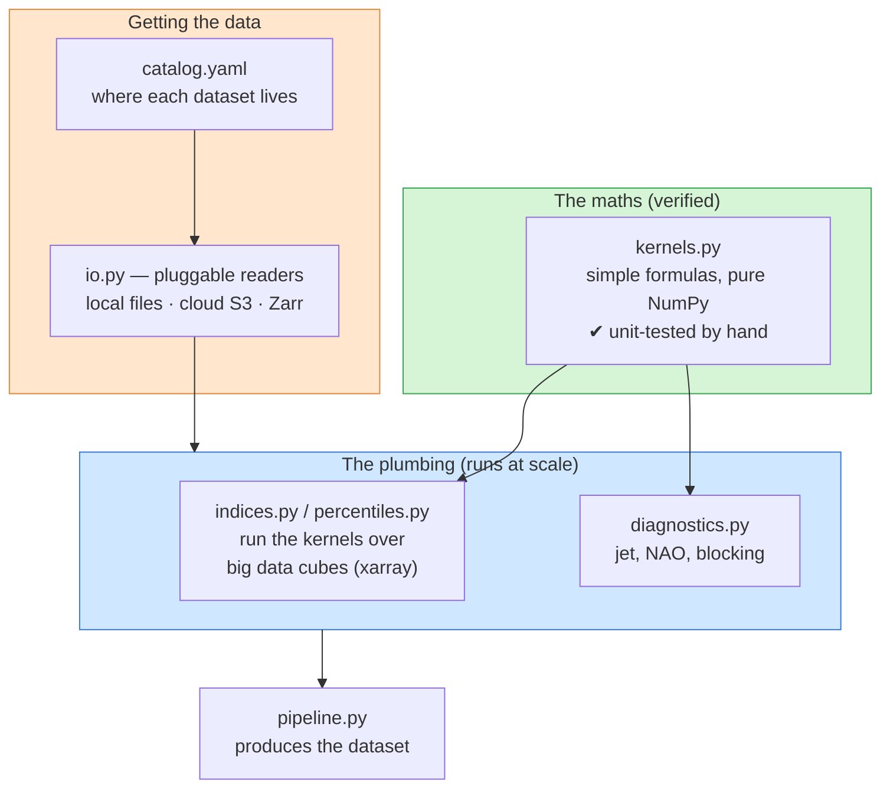

Why this matters for the application: it means the index definitions are
**provably correct** (19 tests pass), the same code can read data from anywhere
(your laptop or the cloud) by editing one config file, and adding a new index is
a one-line change. That's exactly the "open, reproducible science" the internship
is about.

### The files in the package

| File | What it's for |
|------|---------------|
| `kernels.py` | The actual extremes formulas (simple, tested) |
| `indices.py` | Runs the temperature/rainfall indices over big datasets |
| `percentiles.py` | The percentile indices + a statistical correction (Zhang 2005) |
| `diagnostics.py` | Jet stream, NAO, storm-track, blocking calculations |
| `io.py` | Reads data from local files, cloud S3, or Zarr — interchangeably |
| `catalog.yaml` | A directory of which model/scenario data lives where |
| `regions.py` | Defines map regions (Mediterranean, Eurasia, etc.) and winter season |
| `pipeline.py` | The "run everything" driver that produces the dataset |
| `synthetic.py` | Makes fake-but-realistic data so the demo runs without the cloud |

---

## 4. Deliverable 2 — the dataset

This is the **output**: the 24 indices computed for every available
model × scenario combination, saved in the standard scientific file format
(**CF-NetCDF**), plus a tidy table of regional averages and example figures.

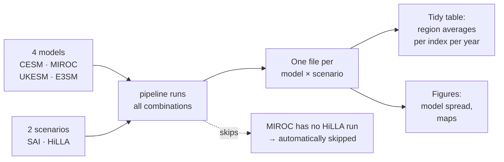

A key honesty note baked into the dataset's manual (`DATA_CARD.md`): the demo
files here were generated on **synthetic (fake) data**, because the real cloud
data wasn't reachable while building this. They have the exact right *structure*
and use the *same tested maths*, but they're for demonstration — point the tool at
the real Cloud Hub and it produces the real dataset unchanged.

The **example figure** already shows the expected story: under SAI, Eurasian
winters have **fewer frost days** than under HiLLA — the milder-winter signal the
science predicts.

---

## 5. Deliverable 3 — the uncertainty assessment

The Reflective "SAI Uncertainty Database" has a public entry called
**Extratropical Circulation**. This deliverable is a **revised version** of that
entry, bringing in the brand-new multi-model evidence and proposing updated
ratings.

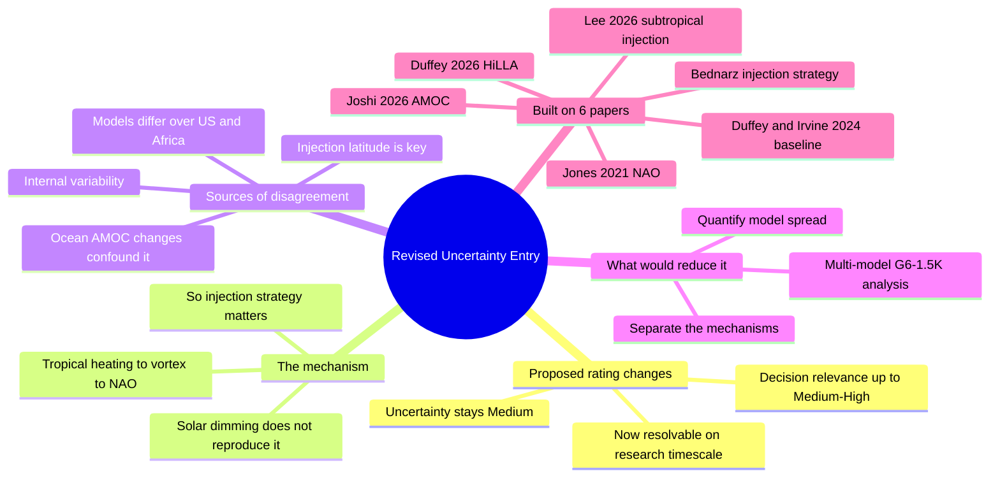

In short, it argues: the *mechanism* is well understood, but *how strongly* it
shows up — and whether models agree — is the open question, and we can now make
progress because the data finally exist. It even flags a subtle but important
methodological point (the "baseline" you compare against changes the answer, from
Duffey & Irvine 2024).

---

## 5.5. The 10-week plan at a glance

The internship runs as a 10-week project (1 June – 14 August 2026). Here's the
schedule as a timeline, colour-coded by phase. The first weeks ("what happens to
extremes") build Deliverables 1 & 2; the later weeks ("why it happens") add the
circulation diagnostics and the written assessment (Deliverable 3).

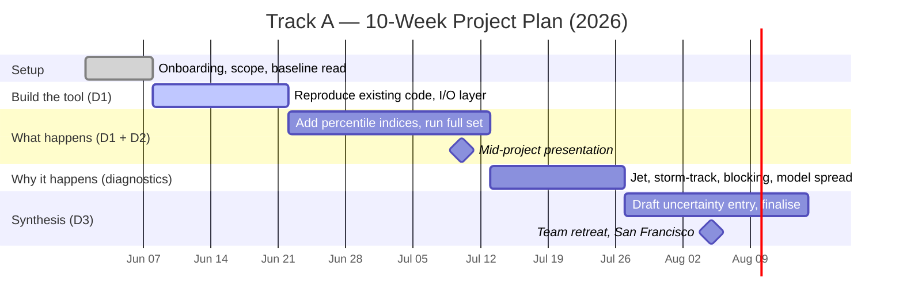

| Weeks | Dates | Focus | Produces |
|-------|-------|-------|----------|
| 1 | Jun 1–7 | Onboarding, agree scope, confirm 4 models | — |
| 2–3 | Jun 8–21 | Reproduce code, build tested I/O layer | Deliverable 1 (core) |
| 4–6 | Jun 22–Jul 12 | Add percentile indices, run everything | Deliverables 1 & 2 |
| 7–8 | Jul 13–26 | Jet / storm-track / blocking, model spread | Circulation diagnostics |
| 9–10 | Jul 27–Aug 14 | Write-up, finalise figures, release | Deliverable 3 |

> **Where this repo stands:** the work delivered here corresponds to Weeks 2–6
> (the tool + dataset) plus a working build of the Weeks 7–8 diagnostics and a
> first draft of the Week 9–10 write-up — i.e. it front-loads the full pipeline so
> the later weeks become analysis rather than engineering.

---

## 6. Frequently asked questions

**Q: Is this real climate data?**
No — the demo numbers were made with a synthetic ("fake but realistic") data
generator, because the real GeoMIP data on Reflective's Cloud Hub wasn't
reachable while building this. The *code*, *file formats*, and *maths* are all
real and tested; only the input numbers are stand-ins. Point the tool at the real
Cloud Hub and it produces real results with no code changes. This is stated
openly in the data card.

**Q: So is the project still valid for the application?**
Yes. The internship is explicitly about *demonstrating open-science workflows and
communicating uncertainty*, not about having the final scientific answer. A
correct, tested, reproducible pipeline plus a well-reasoned uncertainty write-up
is exactly the deliverable. The synthetic demo proves the whole thing runs
end-to-end.

**Q: Why are there "kernels" and a separate "xarray layer"? Isn't that
duplication?**
They're not duplicates — they're two roles. The *kernel* is the actual formula
(simple, testable). The *xarray layer* just applies that one formula efficiently
across a huge grid. There's a test that checks they always agree, so the formula
exists in exactly one place. This makes the maths easy to verify and the code
easy to trust.

**Q: What's the difference between G6-1.5K-SAI and G6-1.5K-HiLLA again?**
Both are SAI (cooling particles), aiming for the same ~1.5 °C target. They differ
in *where* the particles go: **SAI** injects in the subtropics (30°N/30°S),
producing strong tropical stratospheric heating; **HiLLA** injects high-latitude,
low-altitude, seasonally (60°N/S, 13–15 km), producing much less tropical heating.
Comparing them isolates *how much* of the winter-wind effect comes from that
tropical heating.

**Q: Why does the jet stream / NAO matter for "extreme weather"?**
The jet stream and the NAO are the "steering wheel" for European and North
American winters. A more positive NAO and a poleward jet bring milder, wetter,
stormier conditions to the north and drier conditions to the Mediterranean. So if
SAI nudges these, it changes how extreme winters are — even if the global average
temperature is unchanged.

**Q: What are "ETCCDI indices"?**
An internationally agreed set of ~27 standard recipes for measuring climate
extremes from daily data (e.g. "frost days" = days below 0 °C). Using the standard
recipes means the results can be compared with everyone else's. This project
implements 24 of them, including the trickier percentile-based ones.

**Q: What does the "CI / green check" on GitHub mean?**
Every time code changes, GitHub automatically re-runs all the tests. A green check
means every test passed on every supported Python version — evidence the code
works and stays working.

**Q: Can someone reproduce my results?**
Yes — that's the whole point. They clone the repo, run one command, and get the
same demo dataset and figures, with no large downloads. With Cloud Hub access they
get the real dataset the same way.

**Q: Which file should I show in an interview?**
Lead with this guide (the big picture), then the demo notebook (the guided tour
with charts), then `kernels.py` + its tests (to show the maths is correct), and
finally the Deliverable 3 write-up (to show the science reasoning).

---

## 7. How to actually run it

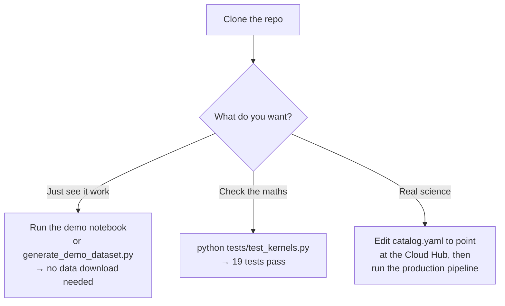

Concretely, on a computer with Python:

```bash
# 1. get the code
git clone https://github.com/clevernat/fafrifa.git
cd fafrifa/deliverable-1-workflow/sai-extremes

# 2. install it (light version is enough to see it work)
pip install -e ".[all]"

# 3. prove the maths is right (no data needed)
python tests/test_kernels.py        # 9 tests
python tests/test_percentiles.py    # 3 tests
python tests/test_diagnostics.py    # 7 tests

# 4. make the demo dataset + figures (no data needed)
python ../../deliverable-2-dataset/scripts/generate_demo_dataset.py

# 5. open the guided tour
jupyter lab notebooks/01_extremes_workflow_demo.ipynb
```

Everything in steps 3–4 runs on **synthetic data**, so it works on any laptop with
no special access. Step 5's notebook walks through the whole story with charts.

---

## 8. Automated testing (CI)

Every time code is pushed to GitHub, a robot (**GitHub Actions**) automatically
re-runs all the tests on several Python versions, and even regenerates the demo
dataset, to make sure nothing is broken. You can watch it under the **Actions**
tab of the repo. A green check = everything works.

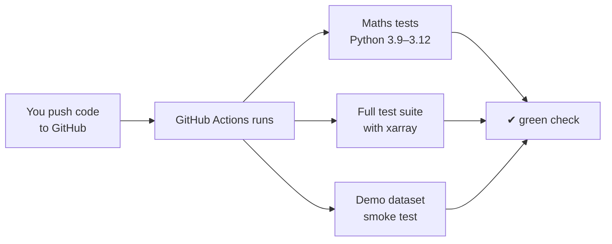

---

## 9. Where to look for what

| If you want to… | Open this |
|-----------------|-----------|
| Understand the whole project in plain English | **this file** |
| See a one-paragraph professional summary | `README.md` (repo root) |
| Read the technical package docs | `deliverable-1-workflow/sai-extremes/README.md` |
| Understand the dataset's contents | `deliverable-2-dataset/DATA_CARD.md` |
| Read the science write-up | `deliverable-3-uncertainty-entry/…REVISED.md` |
| See the code that does the maths | `…/sai_extremes/kernels.py` |
| Take the guided tour with charts | `…/notebooks/01_extremes_workflow_demo.ipynb` |

---

## 10. One-paragraph summary you can reuse

> This project is an open-science prototype for the Reflective SAI Uncertainty
> Database (Track A). It delivers (1) `sai_extremes`, a tested Python workflow that
> computes 24 ETCCDI climate-extremes indices and jet/NAO/blocking diagnostics for
> the GeoMIP G6-1.5K-SAI and G6-1.5K-HiLLA experiments across four Earth system
> models, with a pluggable cloud I/O layer; (2) a multi-model indices dataset with
> a documented schema and data card; and (3) a revised "Extratropical Circulation"
> uncertainty assessment synthesising the latest literature. Together they quantify
> how — and how consistently across models — stratospheric aerosol injection
> reshapes Northern-Hemisphere mid-latitude winter extremes, and demonstrate a
> reproducible, cloud-based workflow for communicating that uncertainty.
```
